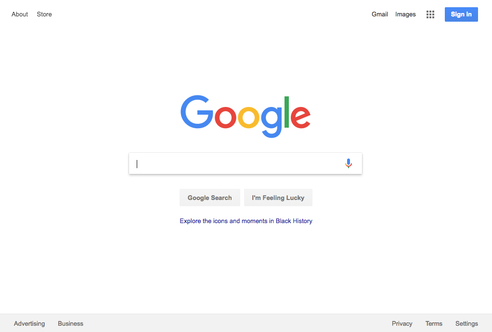

# HTML & CSS Project

*__Building Google.com__*

## Introduction

For this mini-project, you’ll deconstruct an existing web page and rebuild it. Don’t worry if the links don’t go anywhere and the search box doesn’t do anything when you submit it. The goal is to start thinking about how elements get placed on the page and roughly how they get styled and aligned. For some of you, this may be the first time you’ve actually tried to “build” something in HTML (very exciting!).

Using the browser’s developer tools (right clicking something on the page and clicking “inspect element” will get you there) will be your best friend.

## Setting up your Repository

Your first step here is to create your repository using GitHub Desktop.

1. Open GitHub Desktop.

2. From the File menu, choose **New Repository**.

3. Give your repository the name `Google Homepage` and click **Create Repository**.

4. Open your new repository in Atom.

Be sure to save and commit often (at least at the end of each class). The more you commit the more options you have to go back on if something doesn't work the way you intended it to.

## Creating the Site Files

For this project you'll need to create two files: an **index.html** file and a **style.css** file. Once those files are created that's it! Now it's your turn to begin building on your own.

## Directions

Build the Google.com homepage *(the simple one with just a search box)*

### Tips:
- **DON’T BE A PERFECTIONIST!** You’re just trying to make it look like google.com, not actually function like it and it doesn’t have to be spaced exactly the same way to the pixel. Any dropdown menus or form submissions or hover-highlighting should be ignored.

- **USE GOOGLE!** You’ll probably run into roadblocks where you can’t figure out how to do something so do what all good devs do… Google it!

- If you’re frustrated with trying to get buttons or inputs to style the way you want (for instance, they seem to just not respond to any styles), look into the css property `-webkit-appearance: none;` or `-moz-appearance` if you’re using Firefox.

- Start with just putting the main elements on the page (the logo image and search form), then get them placed horizontally. You can either download the Google logo or link directly to its URL on the web in your  tag.
Next do the navbar across the top, first building the content and then trying to position it. Check out how to build a horizontal CSS navbar if you’re lost.

- Finally, put in the footer, which should be very similar to the top navbar.
In general, do as much on your own as you can before relying on the developer tools (or viewing the page’s source code) to help you along.

## Viewing Your Work on the Web

Github allows you to publish web projects directly from a github repository. Doing this will allow you to access your project from `your-gh-username.github.io/your-github-repo-name`

There are a couple of ways to go about doing this, but the simplest is this:

1. Make sure that the main html file of your project is called **index.html**. If it is not, you will need to rename it.

2. Go to your github repo on the web and click the **Settings** button

3. Scroll down until you find the **GitHub Pages** section

4. Change the Source from **none** to **master** branch and click **Save**

  - It may take a few minutes (the GitHub website says up to 10) but your project should be accessible over the web from `your-gh-username.github.io/your-github-repo-name` (obviously substituting your own details in the link)
